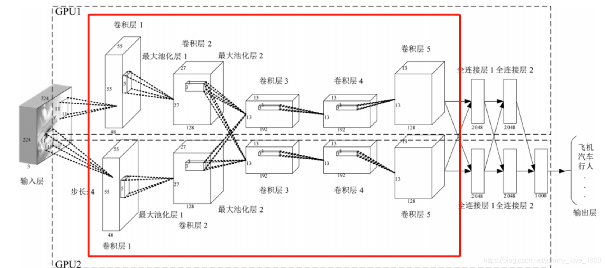

# 深度学习

## 深度学习概述

深度学习的核心是通过多层神经网络模拟人类大脑的层级化信息处理方式，从数据中自动学习特征表示，最终实现分类、回归、生成等任务。与传统机器学习依赖人工设计特征不同，深度学习的"深度"带来了端到端学习的能力，能处理图像、文本、语音等复杂高维数据。

### 传统机器学习 vs 深度学习

- **传统机器学习**："浅层学习"，模型通常只有输入层和输出层，无法处理复杂数据的层级特征，需要人工设计特征，模型学习映射关系。
- **深度学习**：通过堆叠多层隐藏层，实现特征的"自动抽象"：
  - 输入原始数据
  - 浅层隐藏层学习低级特征（边缘、颜色）
  - 深层隐藏层学习高级特征（纹理、物体部件）
  - 输出层完成任务

---

## 神经网络基础

所有深度学习模型的基础是神经网络，核心单元是神经元，多层神经元堆叠形成网络结构。

### 神经元结构

神经元主要结构包括：
- **输入**：接收来自上一层的信号
- **权重与偏置**：`w` 和 `b`，用于计算加权和
- **激活函数**：引入非线性，让网络能够拟合复杂函数

### 层级结构

多层神经元按照功能分为三类：
- **输入层**：接收原始数据
- **隐藏层**：核心特征抽象层，层数越多，能学习的特征越复杂
- **输出层**：输出结果，维度由任务决定

### 参数与超参数

- **参数**：网络自动学习的变量，即所有神经元的权重 `w` 和偏置 `b`，参数数量决定模型复杂度
- **超参数**：人工设定的变量，需通过"调优"确定：
  - 隐藏层数量
  - 每层神经元数
  - 学习率 `η`
  - batch size
  - 直接影响模型性能

---

## 深度学习核心三要素

### 损失函数——判断模型好坏的标尺

判断模型好坏，量化**模型预测值**与**真实标签**的差异，是模型优化的目标。不同任务对应不同损失函数：

- **分类任务**：交叉熵损失，衡量概率分布差异，适用于二分类和多分类
- **回归任务**：均方误差（MSE），衡量连续值预测的误差
- **生成任务**：对抗损失，GAN中用于让生成器生成"逼真数据"的损失，通过生成器与判别器的对抗优化

### 优化器——模型学习的导航仪

优化器的作用是调整参数 `w`、`b`，以最小化损失函数，通过梯度下降实现：计算损失函数对参数的梯度，沿梯度反方向更新参数。

### 反向传播——模型学习的反馈机制

反向传播是计算梯度、更新参数的核心算法，遵循**链式法则**——从输出层到输入层，逐层计算损失函数对每个参数的梯度，再通过优化器更新参数。

#### 流程

1. **前向传播（Forward Pass）**：输入数据通过网络，计算各层输出和最终损失 `L`
2. **反向传播（Backward Pass）**：从输出层开始，计算 `L` 对输出层参数的梯度 → 隐藏层参数的梯度 → 输入层参数的梯度（链式法则）
3. **参数更新（Parameter Update）**：用优化器根据梯度调整参数，如 `w = w - η · ∂L/∂w`，其中 `η` 为学习率

> **关键**：反向传播是深度学习能"自主学习"的核心——没有反向传播，参数无法根据误差调整，模型无法优化。

---

## 核心模型

### 卷积神经网络（CNN）——图像任务的王者

CNN是为处理**网格结构数据**设计的模型，核心创新是卷积操作和池化操作，解决了传统MLP处理图像时"参数爆炸"和"缺乏空间关联性"的问题。

#### 核心机制

- **卷积操作**：用卷积核在图像上滑动，提取局部空间特征（如边缘、纹理），通过**参数共享**（同一卷积核在全图共享参数）大幅减少参数量
- **池化操作**：对卷积输出做"下采样"（如最大池化、平均池化），降低特征图尺寸，减少计算量，同时增强模型对图像平移、缩放的鲁棒性
- **层次结构**：
  - 浅层（卷积+池化）：学习低级特征（边缘、颜色）
  - 深层（卷积+全连接）：学习高级特征（语义）

#### 经典模型

| 模型 | 年份 | 特点 |
|------|------|------|
| LeNet-5 | 1998 | 首个CNN，用于手写数字识别 |
| AlexNet | 2012 | CNN爆发的标志，使用ReLU和GPU加速，ImageNet分类准确率大幅提升 |
| ResNet | 2015 | 引入"残差连接"，解决深层网络的"梯度消失"问题，可训练1000层以上网络 |
| YOLO、Faster R-CNN | - | 基于CNN的目标检测模型，实现"实时识别图像中的物体位置" |

#### 应用场景

图像分类、目标检测、图像分割、图像生成

#### 关键概念

**什么是感受野？**

感受野指的是卷积神经网络每一层输出的特征图上每个像素点映射回输入图像上的区域大小：
- 神经元感受野的范围越大，表示其能接触到的原始图像范围越大，能学习更为全局、语义层次更高的特征信息
- 范围越小，表示其所包含的特征越趋向局部和细节
- 网络越深，神经元的感受野越大

> 深度卷积神经网络中：
> - 靠前的层：感受野较小，提取图像的纹理、边缘等局部的、通用的特征
> - 靠后的层：感受野较大，提取图像更深层、更具象的特征

**什么是下采样？**

下采样作用：
1. 减少计算量，防止过拟合
2. 增大感受野，使得后面的卷积核能够学到更加全局的信息

下采样设计有两种：
- 采用步长（stride）为2的池化层，如Max-pooling或Average-pooling，目前通常使用Max-pooling，因为它计算简单且最大响应能更好保留纹理特征
- 采用步长（stride）为2的卷积层，下采样的过程是一个信息损失的过程，而池化层是不可学习的，用stride为2的可学习卷积层来代替pooling可以得到更好的效果，当然同时也增加了一定的计算量

**什么是上采样？**

在卷积神经网络中，由于输入图像通过CNN提取特征后，输出的尺寸往往会变小，而有时需要将图像恢复到原来的尺寸以便进行进一步的计算（如图像的语义分割），这个使图像由小分辨率映射到大分辨率的操作，叫做上采样。

上采样的实现方式：
- **插值**：一般使用双线性插值，效果最好，虽然计算上比其他插值方式复杂，但相对于卷积计算可以说不值一提
- **转置卷积（反卷积）**：通过对输入feature map间隔填充0，再进行标准的卷积计算，可以使得输出feature map的尺寸比输入更大
- **Max Unpooling**：在对称的max pooling位置记录最大值的索引位置，然后在unpooling阶段时将对应的值放置到原先最大值位置，其余位置补0

---

### 循环神经网络（RNN）——序列数据的专属模型

RNN是为处理**序列数据**设计的模型，核心创新是隐藏状态的**记忆性**——当前输出不仅依赖当前输入，还依赖上一时刻的隐藏状态，能捕捉序列的"时序关联性"。

#### 核心机制

**循环结构**：RNN的隐藏层包含"循环单元"，假设时刻 `t` 的输入为 `x_t`，隐藏状态为 `h_t`，则：

$$h_t = f(W_{xh}x_t + W_{hh}h_{t-1} + b_h)$$
$$y_t = W_{hy}h_t + b_y$$

其中 `W_{hh}` 是"循环权重"，使 `h_t` 携带上一时刻 `h_{t-1}` 的信息（记忆）。

#### 局限性

传统RNN存在**长期依赖问题**——当序列过长（如100个单词的句子），梯度在反向传播时会"消失或爆炸"，无法捕捉长距离时序关联。

#### 改进模型：LSTM和GRU

为解决长期依赖问题，研究者提出了"门控循环单元"：

- **LSTM（长短期记忆网络）**：通过"输入门、遗忘门、输出门"控制信息的"存入、遗忘、输出"，能有效保存长序列的关键信息（如理解"上下文很长的句子"）
- **GRU（门控循环单元）**：简化LSTM的门结构（合并为"更新门、重置门"），在保持性能的同时减少计算量

---

## 其他重要模型

### Transformer

> TODO：待补充内容

### 生成对抗网络（GAN）

> TODO：待补充内容

### 深度强化学习

> TODO：待补充内容
