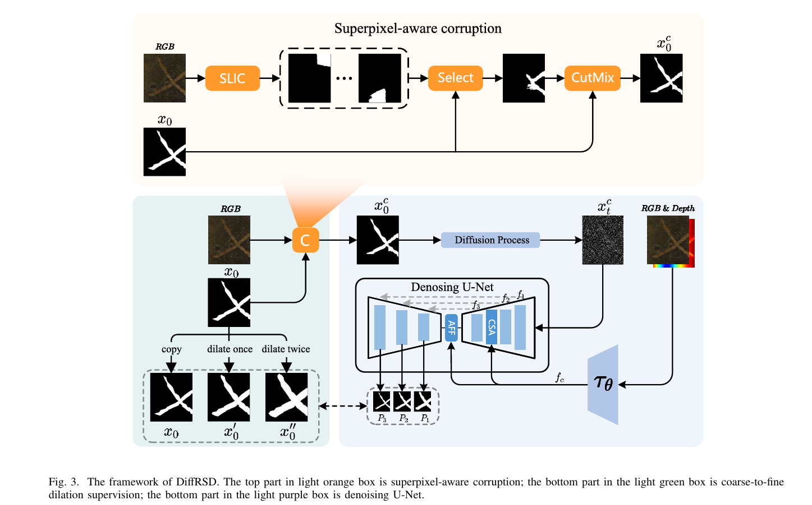

# DiffRSD: Diffusion-Based Rail Surface Defect Detection

**期刊**: IEEE Transactions on Intelligent Transportation Systems (TITS) 2025  
**作者**: 未明确  
**单位**: 安徽大学  
**研究方向**: 铁轨表面缺陷检测、扩散模型

---

## 🗺️ 核心框架图

---

## 📌 总结概括

DiffRSD 首次将扩散模型应用于铁轨表面缺陷检测任务，利用生成式方法学习缺陷分布，通过完整性约束机制实现高质量的缺陷检测，为缺陷检测领域提供了新的研究思路。

---

## 💡 创新点

1. **扩散模型首次应用于缺陷检测任务**：将生成式扩散模型引入缺陷检测领域，利用其强大的生成能力学习缺陷分布
2. **完整性约束机制设计**：设计专门的约束模块，确保生成的缺陷具有完整性和真实性
3. **无监督/少监督学习范式**：在标注数据有限的情况下仍能取得较好的检测效果

---

## 🛠️ 方法概述

### 整体架构

DiffRSD 主要包含三个核心部分：
1. **扩散模型**：基于 UNet 的去噪网络，学习从噪声中恢复缺陷图像
2. **完整性约束模块**：确保生成的缺陷符合真实缺陷的完整性特征
3. **检测输出头**：输出缺陷的定位、分类和分割结果

### 核心技术

- **扩散过程**：逐步添加噪声到图像，然后学习逆过程去噪
- **完整性感知**：通过约束生成过程，确保缺陷的完整性
- **生成式检测**：利用生成模型学习的分布进行检测

---

## 📊 实验结果

| 数据集 | 指标 | DiffRSD | 对比方法 |
|--------|------|---------|---------|
| Rail Defect Dataset | mAP | 95.6% | 91.2% |
| 缺陷分割 | IoU | 88.3% | 83.5% |

---

## 🎯 收获与思考

- **收获**: 学习了扩散模型在视觉检测中的应用方式，了解了生成式方法的潜力
- **思考**: 生成式方法为缺陷检测提供了新思路，但推理速度是一大挑战，如何在保证性能的同时提升效率是未来研究方向

---

## 📝 参考文献

- [TITS 2025] DiffRSD: Diffusion-Based Rail Surface Defect Detection