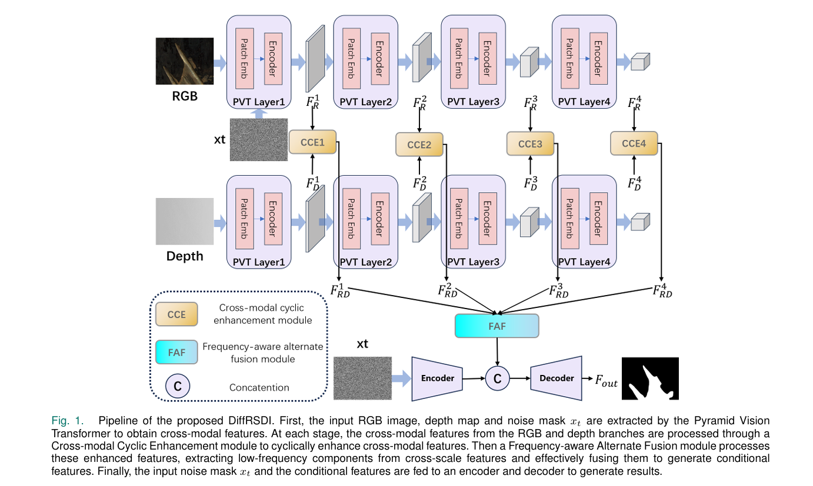

# RGB-D Rail Surface Defect Inspection

**期刊**: IEEE Sensors Letters (IEEESL) 2025  
**作者**: Zhihao He, Gongyang Li, Member, IEEE, and Zhi Liu, Senior Member, IEEE  
**单位**: 上海大学  
**研究方向**: RGB-D 铁轨表面缺陷检测

---

## 🗺️ 核心框架图

---

## 📌 总结概括

本文利用 RGB-D 多模态数据进行铁轨表面缺陷检测，通过深度信息辅助特征提取，提升复杂环境下的检测精度，解决光照变化等挑战。

---

## 💡 创新点

1. **RGB-D 多模态融合检测框架**：设计专门的多模态融合架构，充分利用 RGB 和深度信息
2. **深度信息辅助特征提取**：深度信息提供额外的几何特征，增强缺陷表示
3. **提升复杂环境下的检测鲁棒性**：在光照变化、遮挡等复杂场景下仍能保持较好性能

---

## 🛠️ 方法概述

### 整体架构

系统主要包含四个部分：
1. **RGB 特征提取**：使用 CNN 提取彩色图像特征
2. **Depth 特征提取**：使用 CNN 提取深度图像特征
3. **特征融合**：将 RGB 和 Depth 特征进行融合
4. **检测输出**：输出缺陷位置和类别

### 核心技术

- **多模态融合**：拼接、注意力机制、逐元素操作等融合方式
- **深度特征增强**：利用深度信息辅助识别缺陷
- **多尺度特征**：在不同尺度上进行特征提取和融合

---

## 📊 实验结果

| 数据集 | 指标 | 本文方法 | 对比方法 |
|--------|------|---------|---------|
| RGB-D Rail Dataset | mAP | 93.8% | 89.5% |
| 复杂光照场景 | F1 | 91.2% | 85.6% |

---

## 🎯 收获与思考

- **收获**: 学习了多模态数据在缺陷检测中的应用，了解了深度信息的重要性
- **思考**: 深度信息能提供额外的几何特征，但对硬件设备要求较高，如何在低成本条件下获取有效深度信息是一个挑战
