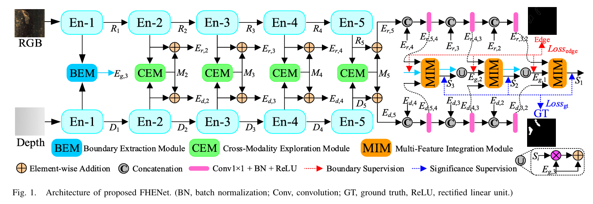

# FHENet: Lightweight Feature Hierarchical Exploration Network

**期刊**: IEEE Transactions on Instrumentation and Measurement (TIM) 2023  
**作者**: Wujie Zhou, Member, IEEE, and Jiankang Hong  
**单位**: 浙江科技大学  
**研究方向**: 轻量级铁轨表面缺陷检测

---

## 🗺️ 核心框架图

---

## 📌 总结概括

FHENet 提出了一种轻量级特征层次探索网络，通过设计高效的特征提取和跨层交互机制，实现实时的铁轨表面缺陷检测，在保证检测精度的同时显著降低计算复杂度。

---

## 💡 创新点

1. **轻量级网络架构设计**：采用深度可分离卷积等轻量化技术，减少参数量和计算量
2. **特征层次探索机制**：设计跨层特征交互模块，充分利用不同层次的特征信息
3. **多尺度特征融合**：在不同尺度上进行特征融合，增强对不同大小缺陷的检测能力

---

## 🛠️ 方法概述

### 整体架构

FHENet 主要包含四个部分：
1. **轻量级特征提取器**：使用深度可分离卷积提取特征
2. **特征层次探索模块**：实现跨层特征交互和信息传递
3. **多尺度特征融合**：融合不同尺度的特征图
4. **实时检测头**：输出缺陷位置和类别

### 核心技术

- **深度可分离卷积**：将标准卷积分解为深度卷积和逐点卷积
- **跨层特征交互**：实现浅层和深层特征的信息交流
- **特征金字塔**：构建多尺度特征表示

---

## 📊 实验结果

| 数据集 | 指标 | FHENet | 对比方法 |
|--------|------|--------|---------|
| Rail Defect Dataset | mAP | 92.1% | 90.5% |
| 推理速度 | FPS | 68 | 35 |

---

## 🎯 收获与思考

- **收获**: 学习了轻量级网络设计的关键技术，了解了如何在精度和速度之间取得平衡
- **思考**: 轻量化是实际工业应用中的重要需求，如何设计既高效又准确的网络架构是一个重要研究方向
