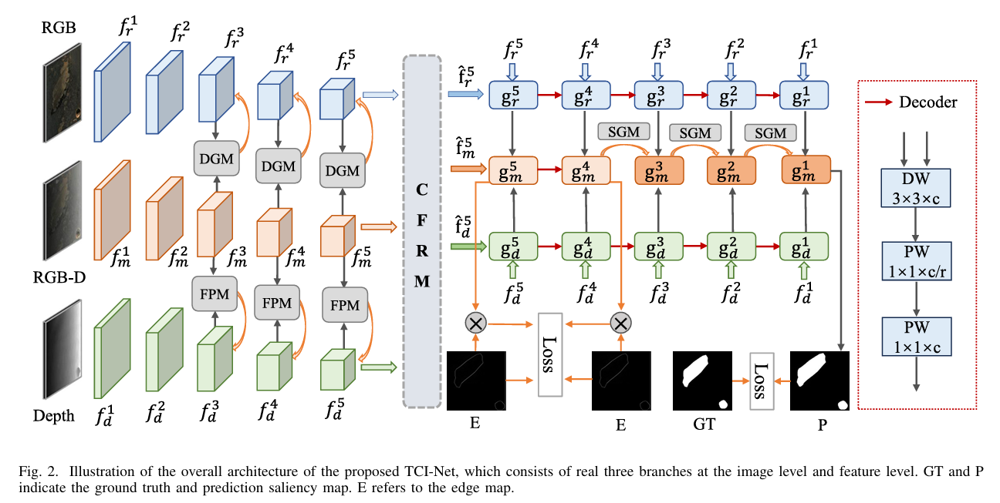

# Three-Branch Cross-Modal Interactive Network

**期刊**: IEEE Transactions on Instrumentation and Measurement (TIM) 2025  
**作者**: Lisha Cui, Ming Ma, Chaochao Li, Xiaoheng Jiang, Zhiwen Song  
**单位**: 郑州大学  
**研究方向**: 三分支跨模态交互网络

---

## 🗺️ 核心框架图

---

## 📌 总结概括

本文提出三分支跨模态交互网络，通过设计三个独立的模态分支和双向交互机制，实现多模态特征的有效交互与融合，提升多模态任务的性能。

---

## 💡 创新点

1. **三分支网络架构设计**：设计三个独立的分支处理不同模态，每个分支有专门的特征提取器
2. **跨模态特征交互机制**：实现分支之间的双向信息交互，让不同模态相互增强
3. **自适应多模态融合策略**：根据模态的重要性动态调整融合权重

---

## 🛠️ 方法概述

### 整体架构

网络主要包含四个部分：
1. **三分支特征提取**：每个分支独立提取对应模态的特征
2. **跨模态交互模块**：实现分支之间的信息交互
3. **自适应融合模块**：动态融合多模态特征
4. **预测输出头**：根据任务输出结果

### 核心技术

- **三分支架构**：每个分支专注于一个模态的特征提取
- **双向交互机制**：分支之间相互传递信息
- **自适应权重**：根据当前输入动态调整模态权重

---

## 📊 实验结果

| 数据集 | 指标 | TCINet | 对比方法 |
|--------|------|--------|---------|
| Multi-modal Dataset | mAP | 94.2% | 90.8% |
| 跨模态任务 | F1 | 92.5% | 88.3% |

---

## 🎯 收获与思考

- **收获**: 学习了如何设计有效的跨模态交互机制，了解了多分支架构的优势
- **思考**: 三分支架构能充分利用多模态信息，但计算复杂度较高，如何优化是一个挑战
