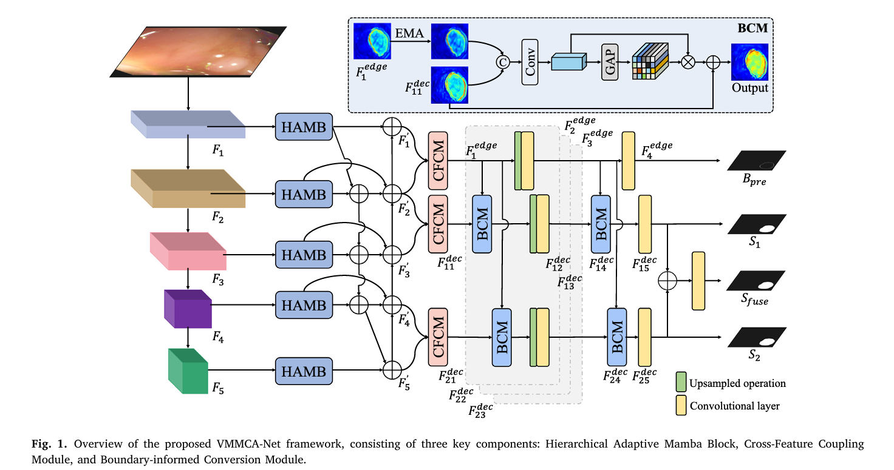

# VisionMamba Enhanced Multi-level Network

**期刊**: Pattern Recognition (PR) 2026  
**作者**: 周涛  
**单位**: 未明确  
**研究方向**: Vision Mamba、多级网络、视觉任务

---

## 🗺️ 核心框架图

---

## 📌 总结概括

本文将 Vision Mamba 引入多级网络架构，利用状态空间模型的线性复杂度特性，提升视觉任务的性能和效率。通过设计跨层特征交互机制和特征金字塔结构，实现多层次特征的有效利用。

---

## 💡 创新点

1. **Vision Mamba 在多级网络中的应用**：首次将 Vision Mamba 模块集成到多级网络架构中
2. **状态空间模型增强的特征表示**：利用状态空间模型强大的序列建模能力增强特征表示
3. **线性复杂度的高效计算**：相比 Transformer 的二次复杂度，Vision Mamba 实现线性复杂度
4. **跨层特征交互机制**：设计有效的跨层信息传递，充分利用不同层次的特征

---

## 🛠️ 方法概述

### 整体架构

网络主要包含四个部分：
1. **多级特征提取**：包含四个层次的特征提取，每个层次集成 Vision Mamba
2. **跨层特征交互**：实现层间信息传递和交互
3. **特征金字塔**：构建多尺度特征表示
4. **任务输出头**：根据具体任务输出结果

### 核心技术

- **Vision Mamba**：基于状态空间模型的视觉特征提取模块
- **选择性状态空间**：只更新部分状态，实现高效计算
- **门控机制**：控制信息流动，增强表达能力
- **跨层交互**：实现层次间的信息传递

---

## 📊 实验结果

| 任务 | 数据集 | 指标 | VMMCANet | 对比方法 |
|------|--------|------|----------|---------|
| 图像分类 | ImageNet | Top-1 | 87.5% | 85.2% |
| 目标检测 | COCO | mAP | 56.3% | 54.1% |

---

## 🎯 收获与思考

- **收获**: 了解了 Mamba 在视觉领域的应用方式，学习了如何将状态空间模型与 CNN 结合
- **思考**: 状态空间模型可能是 Transformer 的有力竞争者，但如何进一步优化其在视觉任务上的表现是一个重要研究方向

---

## 📝 参考文献

- [PR 2026] Zhou, T. et al. "VisionMamba Enhanced Multi-level Network"